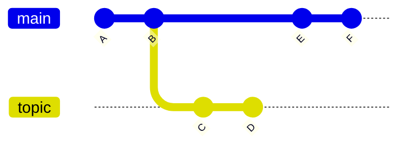

# 7.1 Git Tools - Revision Selection

## Single Revisions

```bash
# 모두 동치. 단 모호하지 않다는 가정 하에
$ git show 1c002dd4b536e7479fe34593e72e6c6c1819e53b
$ git show 1c002dd4b536e7479f
$ git show 1c002d
```

- full, 40-character SHA-1 hash
- Short SHA-1 hash
  - 해시 시작부터 최소 4자 이상이며 모호하지 않은 부분 해시
  - 보통 8-10자는 충분하다고 여겨짐
  - `git log`의 `--abbrev-commit`는 7자 이상의 모호하지 않은 짧은 해시를 출력
- 참고: SHA-1의 충돌 가능성은 매우 낮지만 여러 우려 때문에 SHA256을 기본 해싱 알고리즘으로 사용하려는 움직임이 있음

## Branch References

```bash
# ca82a6d <- topic1 일 때 아래 두 명령은 동치
$ git show ca82a6dff817ec66f44342007202690a93763949
$ git show topic1
```

- 브랜치 이름으로 브랜치가 가리키는 커밋을 참조 가능
- `git rev-parse topic1`: 특정 브랜치가 가리키는 커밋의 SHA-1만 출력

## RefLog Shortnames

```bash
$ git reflog
734713b HEAD@{0}: commit: Fix refs handling, add gc auto, update tests
d921970 HEAD@{1}: merge phedders/rdocs: Merge made by the 'recursive' strategy.
1c002dd HEAD@{2}: commit: Add some blame and merge stuff
1c36188 HEAD@{3}: rebase -i (squash): updating HEAD
95df984 HEAD@{4}: commit: # This is a combination of two commits.
1c36188 HEAD@{5}: rebase -i (squash): updating HEAD
7e05da5 HEAD@{6}: rebase -i (pick): updating HEAD
```

- 최근 몇 달 동안의 HEAD와 브랜치 참조의 이동 기록을 담은 로컬 임시 히스토리
- `@{n}`: n번째 이전 커밋
- `@{yesterday}`: 어제 커밋 (너무 오래되어서 reflog에서 지워진 기록은 못 가져옴)
- `git log -g`: git log 형식의 reflog 정보
- 레포를 새로 클론하면 reflog는 비어있음
- 클론 이전의 정보를 가져오려고 하면 로컬에서 커밋한 가장 처음 커밋이 나옴
- 참고: PowerShell에서는 `{`, `}`를 escape 해야함. `"HEAD@{0}"`가 가장 무난

## Ancestry References

```bash
# `^` (caret)
$ git show HEAD^     # the parent of HEAD
$ git show HEAD^2    # the second parent of HEAD

# `~` (tilde)
$ git show HEAD~     # the first parent of HEAD
$ git show HEAD~2    # the first parent of the first parent
$ git show HEAD~~~   # = HEAD~3

# 조합 가능
$ git show HEAD~3^2
```

- `git merge b`에서 현재 브랜치가 첫번째 부모가 되고, b가 두번째 부모가 됨
- 참고: cmd에서 `^`는 escape 해야함. `"HEAD^"`가 가장 무난

## Commit Ranges



```bash
# 모두 같음
$ git log main..topic
$ git log ^main topic
$ git log topic --not main
C
D

$ git log main...topic
F
E
D
C

$ git log --left-right main...topic
< F
< E
> D
> C
```

### Double Dot

- `A..B`: A에 도달할 수 있는 커밋을 제외한 B에 도달할 수 있는 모든 커밋
- `git log origin/main..HEAD`: 원격에 push할 커밋 보기
- `..` 뒤를 생략하면 `HEAD`로 치환

### Multiple Points

```bash
$ git log A B ^C
$ git log A B --not C
```

- 둘 초과의 브랜치를 선택할 때 사용

### Triple Dot

- `A...B`: A와 B에 도달할 수 있지만, 겹치진 않는 모든 커밋
- `git log`는 commit date 순서대로 출력
- `git log`에 `--left-right`를 전달하면 각 커밋이 어느쪽인지 출력
